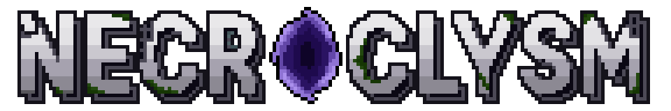

Necroclysm is an open-source roguelike inspired by *Dungeon Crawl: Stone Soup* and *Cataclysm: Dark Days Ahead*.

Your goal is to wander a post-apocalyptic world and collect at least three of the runes hidden across 15 branches. Each rune opens the path deeper into the Abyss, and gathering enough reveals the game's ending.

## License

- **Source code**: Licensed under the [MIT License](LICENSE.txt).
- **Fonts**: Each font retains its original license. See `font/gulim/OFL.txt` and `font/pretendard/LICENSE.txt`.
- **Art and music**: © 2026 Doyoung Hong (Ignyter). All Rights Reserved.
